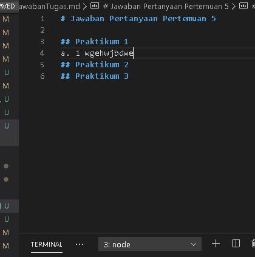

# Jawaban Pertanyaan Pertemuan 5

## Praktikum 1
### a. Mengganti class container-fluid menjadi container atau sebaliknya

Tampilan Container-fluid dan Container 

Class container akan membuat tampilan dan item di dalamnya masuk kedalam wadah kontainernya (cenderung lebih masuk ke tengah) jadi lebih stabil pada saat dizoom in/out. Sedangkan container-fluid tampilan akan lebih menyebar dan merata (seperti penuh) dan tidak stabil pada saat dizoom in/out.

### b. Menginstall modulenya dengan menggunakan package manager seperti npm atau yarn

## Praktikum 2
Karena setiap port hanya dapat menjalankan 1 proses.

json-server tidak dapat berjalan karena port 3000 sudah digunakan oleh react

## Praktikum 3
Data yang dihapus akan hilang pada saat button Hapus diklik

listArtikel.json akan berkurang juga isinya sesuai data yang dihapus berdasarkan id

Untuk merequest ke json-server dengan method DELETE dengan parameter "id" dari artikel yang akan dihapus, lalu json-server akan menghapus artikel berdasarkan "id" tersebut yang dikirimkan. Lalu Menfetch semua data baru (data yang telah dihapus tidak ikut terambil)

API yang diambil memiliki sumber data yang berbeda, yang satunya di jsonplaceholder, sedangkan satunya berada di local dengan sumber data listArtikel.json

## Praktikum 4
listArtikel.json akan menambahkan data yang diinputkan pada form, sehingga terdapat data baru

Karena data yang difetch oleh react akan di order secara descending, sehingga data yang berada dibawah di listArtikel.json akan berada di atas saat ditampilkan oleh react

